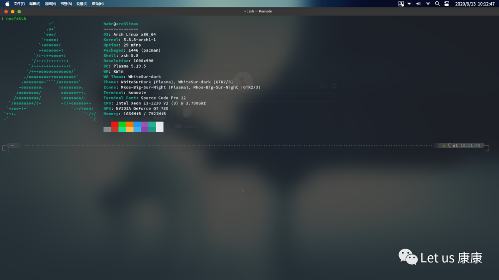

# 快速配置Archlinux+图形环境

大约两个月前，我从Manjaro转回了Windows10，然后现在 真香。不过我经常要用Windows下的东西，所以也不能完全抛弃...所以我之前安装了Hyper-V（为啥是他呢？因为WSL也是用的Hyper-V，如果你要用WSL，那你就装不成其他虚拟化软件- -）

下面我们开始一步步安装系统。

## 1.下载系统

国内最受欢迎的几个镜像源：

- [清华大学TUNA协会](https://mirrors.tuna.tsinghua.edu.cn/)
- [中科大网络信息中心](https://mirrors.ustc.edu.cn/)
- [阿里云](https://help.aliyun.com/document_detail/102593.html)
- [腾讯云](https://cloud.tencent.com/document/product/460/6928)

我们随便在一个里面下载Archlinux的镜像。

## 2.安装

创建Hyper-V虚拟机的过程就省略了，

启动前，我们设置光盘启动为第一位顺序，然后开机，等待加载bash，加载好后，开始准备安装。

### 1.准备工作

验证启动模式，

```bash
ls /sys/firmware/efi/efivars
```

由于我用的Hyper-V，所以并不需要太多的配置。

```bash
dhcpcd # 启动DHCPCD以获取IP
ping baidu.com # 查看是否连接到网络
```

### 2.系统时间

启动NTP。

```bash
timedatectl set-ntp true
```

### 3.更换pacman镜像源

Archlinux默认的mirror节点的速度对国内用户来说并不友好，我们要切换到国内的节点（如上面提到的三家）

```bash
nano /etc/pacman.d/mirrorlist
# 在打开的编辑器里的第一行加入
Server = https://mirrors.tuna.tsinghua.edu.cn/archlinux/$repo/os/$arch
```

### 4.分区

分区是很重要的一步

```bash
cfdisk
```

启动后，选择第一种类型(gpt)；

首先我们创建主分区。选择 **New** ，然后输入大小（建议分大点，这个是系统的主体）；

然后创建我们的Home分区，再次选择 **New** ,然后输入一个稍小的大小；

接着创建EFI分区，选择 **New** ，大小填 **300M** (也可以自己定，不要太大了)，然后在 **Type** 里选择第一种类型 **EFI System** ；

最后我们创建交换分区，选择New，大小在 **1G** - **4G** 之间， **Type** 选择 **Linux swap** ；

检查无误后，选择 **Write** 并确定。确定后输入 **quit** 退出。

接下来我们对我们刚刚分的区进行格式化，在此之前先要确定分区对应的位置，避免格式错误，

```bash
fdisk -l

# EFI分区 我这里是sda3
mkfs.vfat /dev/sda3

# 根分区
mkfs.ext4 /dev/sda1

# Home分区
mkfs.ext4 /dev/sda2

# 交换分区
mkswap -f /dev/sda4
swapon /dev/sda4
```

### 5.安装

首先我们要挂载我们的各分区，

```bash
# 挂载根分区
mount /dev/sda1 /mnt

# 挂载Home分区
mkdir /mnt/home
mount /dev/sda2 /mnt/home

# 挂载EFI分区
mkdir /mnt/boot
mkdir /mnt/boot/EFI
mount /dev/sda3 /mnt/boot/EFI
```

然后我们就可以开始安装我们的系统包了（这一步需要一定的时间），

```bash
pacstrap /mnt linux linux-firmware base base-devel dhcpcd networkmanager netctl nano vim vi wpa_supplicant iw dialog intel-ucode
```

下载+安装完成后，我们生成fstab。

```bash
genfstab -U /mnt >> /mnt/etc/fstab
cat /mnt/etc/fstab
```

### 6.环境配置

接下来我们切换到我们安装的Archlinux。

```bash
arch-chroot /mnt
```

首先配置一下语言，

```bash
nano /etc/locale.gen
```

按 **Ctrl+W** 查找 **en\_US.UTF-8 UTF-8** 及 **zh\_CN.UTF-8 UTF-8** 并且把这两行前面的 **#** 去掉

然后执行命令以确认我们的设置，

```bash
locale-gen
```

接着先设置英文为默认语言，

```bash
echo ‘LANG=zh_CN.UTF-8’ > /etc/locale.conf
```

设置时区，

```bash
ln -sf /usr/share/zoneinfo/Asia/Shanghai /etc/localtime
```

硬件时间同步，

```bash
hwclock --systohc
```

设置root账号的密码，

```bash
passwd
```

接着安装驱动（不同配置的驱动不同，请提前查明自己的硬件对应的包），

```bash
sudo pacman -S intel-ucode # Intel CPU
sudo pacman -S xf86-video-vesa # 英特尔集显
sudo pacman -S nvidia # 英伟达独显
```

接下来配置引导，

```bash
sudo pacman -S grub efibootmgr
grub-install --target=x86_64-efi --efi-directory=/boot/EFI --bootloader-id=grub
grub-mkconfig -o /boot/grub/grub.cfg
```

然后我们的系统就基本安装完成了！接下来准备重启。

```bash
exit
unmount -R /mnt
reboot
```

## 配置

在登录界面，我们分别输入用户名 **root** 和密码，无误后就进入系统了。

首先我们要连到网络。，

第一步我们要知道我们的网卡名称，

```bash
ip link
```

在这里我获取到的网卡名称为 **eth0** ，

```bash
# 让dhcpcd开机启动
systemctl enable dhcpcd
# 打开网卡
ip link set eth0 up
# 重启
reboot
```

重启后，我们再次检测网络连接情况，

```bash
ping baidu.com
```

无误后，我们开始创建我们自己的用户，

root固然强，但权限太高，很不安全，使用aur包也不允许root，

```bash
useradd -m -g users -G wheel -s /bin/bash hobr
```

我们创建了一个名为 **hobr** 的账号，属于 **wheel** 用户组，使用 **bash** ，然后我们为新账号设置密码。

```bash
passwd hobr
```

接下来，我们修改一下sudo，这样就可以在自己的账号里提权了。

```bash
visudo
```

找到 **%whee ALL=(ALL) ALL** ，去掉前面的 **#**，

如果你经常要用root权限但懒得输无数次密码，那就在下一行插入 **Defaults:hobr !authenticate**，修改完成后保存。

## 安装必备软件

接下来退出 **root** 账号，转到我们自己新建的账号，

```bash
exit
```

在此之前我们需要进行必要的初始化，老规矩，配置镜像源并且进行pacman的初始化，

```bash
echo ‘Server = https://mirrors.tuna.tsinghua.edu.cn/archlinux/$repo/os/$arch’ > /etc/pacman.d/mirrorlist

cat >> /etc/pacman.conf <<EOF
[archlinuxcn]
SigLevel = Optional TrustedOnly
Server = https://mirrors.tuna.tsinghua.edu.cn/archlinuxcn/$arch
EOF

sudo pacman -Syy
rm -rf /etc/pacman.d/gnupg
sudo pacman-key --init
sudo pacman-key --populate archlinux
sudo pacman -S archlinux-keyring archlinuxcn-keyring
sudo pacman-key --populate archlinuxcn
```

开始安装一下必备的软件。

### 字体

```bash
sudo pacman -S wqy-microhei wqy-microhei-lite wqy-bitmapfont wqy-zenhei ttf-arphic-ukai ttf-arphic-uming adobe-source-han-sans-cn-fonts adobe-source-han-serif-cn-fonts noto-fonts-cjk ttf-dejavu ttf-liberation
fc-cache -fv
```

### 驱动

```bash
sudo pacman -S pulseaudio alsa-utils pulseaudio-alsa xf86-video-intel nvidia xf86-input-libinput libva libva-intel-driver libva-vdpau-driver libva-utils
```

### Powerline fonts

```bash
git clone https://github.com/powerline/fonts.git --depth=1
cd fonts
./install.sh
cd ..
rm -rf fonts
```

### 输入法

```bash
sudo pacman -S fcitx fcitx-configtool fcitx-im fcitx-googlepinyin
cat > ~/.xprofile <<EOF
export LC_ALL=zh_CN.UTF-8
export XIM=fcitx
export XIM_PROGRAM=fcitx
export GTK_IM_MODULE=fcitx
export QT_IM_MODULE=fcitx
export XMODIFIERS="@im=fcitx"
EOF
```

### KDE

```bash
sudo pacman -S xorg xorg-server plasma kde-applications sddm sddm-kcm
sudo systemctl enable sddm
```

### GNOME

```bash
sudo pacman -S gnome gnome-extra gdm xorg xorg-server xorg-xinit
sudo systemctl enable gdm
reboot
```

### 日用软件

```bash
sudo pacman -S google-chrome gimp yay wget vim zsh aria2 networkmanager ntfs-3g dosfstools bat tree filezilla htop autojump screen vlc screenfetch neofetch file-roller android-tools pamac-aur flashplugin wps-office ttf-wps-fonts wine wine-mono wine_gecko axel haveged openssh sshd
yay -S jetbrains-toolbox
sudo systemctl enable NetworkManager
sudo systemctl enable haveged
yay --aururl "https://aur.tuna.tsinghua.edu.cn" --save
```

### oh-my-zsh

```bash
sh -c "$(curl -fsSL https://raw.github.com/ohmyzsh/ohmyzsh/master/tools/install.sh)"
git clone https://github.com/zsh-users/zsh-completions ${ZSH_CUSTOM:=~/.oh-my-zsh/custom}/plugins/zsh-completions
git clone https://github.com/zsh-users/zsh-syntax-highlighting.git ${ZSH_CUSTOM:-~/.oh-my-zsh/custom}/plugins/zsh-syntax-highlighting
git clone https://github.com/zsh-users/zsh-autosuggestions ${ZSH_CUSTOM:-~/.oh-my-zsh/custom}/plugins/zsh-autosuggestions
nano ~/.zshrc
### theme amuse plugins=(… zsh-completions zsh-syntax-highlighting zsh-autosuggestions)
```

### 开发者常用

```bash
sudo pacman -S nodejs npm python jdk pyenv nvm ruby visual-studio-code-bin docker php gcc clang cmake make automake git linux-headers gdb qt guake
cp /usr/share/applications/guake.desktop /etc/xdg/autostart/
```

### Git

```bash
git config --global user.name "Hobr"
git config --global user.email "yourmail@mail.com"
ssh-keygen -t rsa -C "yourmail@mail.com"
```

### Docker

```bash
sudo chmod a+rw /var/run/docker.sock # 非root权限使用时必须要这样做
sudo curl -L "https://github.com/docker/compose/releases/download/1.25.4/docker-compose-$(uname -s)-$(uname -m)" -o /usr/local/bin/docker-compose
sudo chmod +x /usr/local/bin/docker-compose
curl -sSL https://get.daocloud.io/daotools/set_mirror.sh | sh -s http://f1361db2.m.daocloud.io
```

### Python

```bash
axel -a https://bootstrap.pypa.io/get-pip.py
sudo python get-pip.py
pip config set global.index-url https://pypi.tuna.tsinghua.edu.cn/simple
```

### NodeJS

```bash
npm config set registry https://registry.npm.taobao.org
npm config set sass_binary_site https://npm.taobao.org/mirrors/node-sass/
yarn config set registry https://registry.npm.taobao.org
yarn config set sass_binary_site https://npm.taobao.org/mirrors/node-sass/
```

### Ruby

```bash
gem sources --add https://gems.ruby-china.com/ --remove https://rubygems.org/
bundle config mirror.https://rubygems.org https://gems.ruby-china.com
gem install rails
```

### Rust

```bash
export RUSTUP_DIST_SERVER=https://mirrors.ustc.edu.cn/rust-static
export RUSTUP_UPDATE_ROOT=https://mirrors.ustc.edu.cn/rust-static/rustup
sudo curl https://sh.rustup.rs -sSf | sh
source $HOME/.cargo/env
cat >> $HOME/.cargo/config <<EOF
[source.crates-io]
replace-with = 'ustc'
[source.ustc]
registry = "git://mirrors.ustc.edu.cn/crates.io-index"
EOF
rustup install stable
rustup default stable
rustup component add rust-src
cargo install racer
cargo install rustfmt
```

```bash
# 清理缓存，节省硬盘空间
pacman -Sc
```

## 康康我的成果

你以为我是Mac Big Sur?


其实我是Archlinux+KDE!



论KDE的可玩性，事实证明Linux下桌面环境并不是最大的软肋
