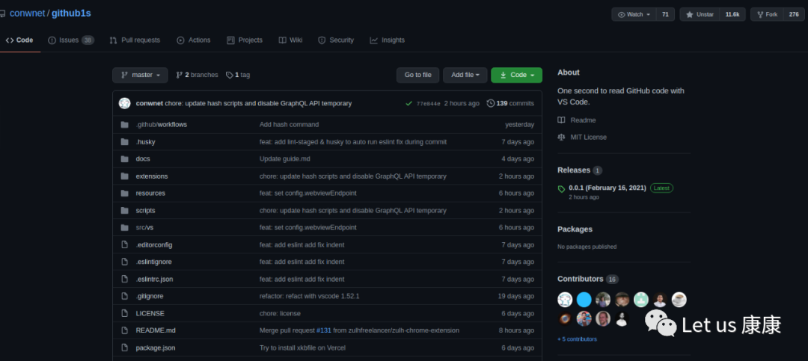

# 给你的Github“+1s”

平时大家在看Github时难免想“细品”一下代码，但又不想clone，怎么办呢？很简单，给你的Github“+1s”即可！

## github1s

最近Github上有一个叫github1s的项目火了

**<https://github.com/conwnet/github1s>**

用法很简单，你只需要在一个repo的网站中的**github**前加**1s**，就可以在线通过VSCode浏览这个repo!

## 更多"1s"

也有网友发现了不少类似的好网址并且总结起来成为"1s repo" <https://github.com/justjavac/1s>
