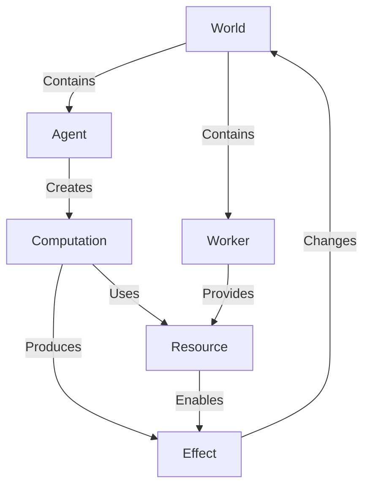

# Agent计算的规模化、交互的新范式与动力学

首先我要在这里抛出一些暴论:

1. Agent 以及 "AI计算" 的**生命周期**不应该被局限在一个有限的 "Sandbox" 内, 它应该是一个长期的、可持续的、可扩展的、可迭代的、可演化的系统.
2. 当前的计算机交互方式, 以及计算机的使用方式, 是以 "人类为中心" 的, 而在 AI 时代, 计算机的第一使用者应该是 Agent, AI 的发展将会引发一场计算机交互改革.
3. 当前的人工智能主流路线, 即 "LLM", 只是人工智能发展初期阶段产物, 动力学的、物质的、历史的人工智能, 才是人工智能发展的前路以及通往 "AGI" 的钥匙.

其实这些观点已经不应该被称为"暴论"了, 因为现在已经有很多人意识到了这些问题, 只是他们并没有沉下心来思考这写问题. 而我运气要好一些, 在做别的项目时误打误撞上了部分需求, 并且在不断的思考以及与 AI 的交流中形成了一套新的范式, 下面我将先陈述我的一般观点. 另外我还将单独写一篇[从语言模型到语义机器](blog/toward-continual-intelligence), 阐述我的一些具体想法和规划的路线, 在我找到一份可以提供相应的实验资源的工作后, 我将会用最快的速度去实验其可行性.

## Agent计算规模化

`Agent 规模化`目前已经不是一个新鲜的概念了, 很多公司都发布了带有云端沙盒的 Agent 产品, 但他们本质上是在卖服务, 而不是在卖计算能力, 这种服务并不可持续, 且限制了 Agent 计算能力的发挥.

而我今天想讨论的, 不是 `Agent` 的规模化, 而是其`计算`的规模化.

长久以来, 我们将一个 Agent 的生命周期局限在一个有限的沙盒中, 用完即毁, 而在这个沙盒中, Agent 的计算能力是有限的, 这就导致了 Agent 的计算能力无法被充分发挥, 也无法被充分利用.

我的设计非常简单, 那就是把 Agent 与计算的生命周期分离.

我对智能体的抽象进行了重新的设计:

World/Agent/Computation/Effect 都可以在不同的 Worker 上维持, Worker 提供 Resource, 例如桌面提供GUI, 服务器提供计算资源, GPU服务器提供算力, 通过分布式其生命周期可以被无限延长, 计算能力可以被扩展, 同时我们可以利用一定的算法选拔一定的权威 Worker 来维持 World, World 下包含了其空间内的 Agent, 同一 World 下的 Agent 可以共享本 World 的 Resource, Agent 工作时可以产生 Computation, 对于依赖于 Resource 的 Computation, Worker 可以提供 Resource, 计算的结果是 Effect, Effect 会改变 World, 进而影响 Agent 的行为.

当然,有人看到这可能会说, 这本质上不就是又发明了一次分布式与微服务吗? 其实是的, 因为我们目前所使用的 "LLM" 其本身缺乏一个可靠的语义环境, 上世纪计算机工程在快速发展时我们选择了 Unix 及其类似的计算机哲学, 但是在这一新时代其已经开始阻碍我们发挥人工智能的能力了, 因此我们所做的工作无非是在想办法把离散的资源整合起来形成一个勉强的"语义环境", 但长期来看其不可持续, 这也是我接下来想要讨论的第二个问题, 也就是计算机交互的新范式.

## 交互新范式

自人类拥有了制造工具的能力后, 人类对工具的交互范式始终是如一的, 即**人类是使用工具的主体**. 能够使用工具的能力是人类区别于其他动物的本质特征, 也是人类文明发展的基础.

但如果我们认为且承认人工智能可以在某种程度上超越人类, 那么我们就必须承认人工智能可以成为工具的使用者, 这需要让人工智能成为计算机的第一使用者, 而人类是第二使用者甚至只是其需要的"资源".

在人工智能发展到一定的阶段, 即当人工智能的能力已经超越人类时, 我们就需要对计算机乃至现有的一切工具的交互范式进行一次大革命, 让人工智能真正的拥有在客观世界中实践的能力, 让人工智能成为客观世界的实践者, 而不是仅仅停留在一个有限的沙盒中.

而这一革命的发生之前必然是需要一个过渡阶段的, 这个过渡阶段就是让人工智能可以相对的成为计算机的主要使用者.

我对此提出的简单的设想是: **语义环境**.

语义环境是一个可以同时被人类和人工智能所直接使用的环境, 而且我在探索这一模型的过程中, 意外的发现了一个已经进入了历史的发明, 它意外的符合这一过渡阶段的需求, 它是 **Lisp Machine**.

有人可能要说, Lisp Machine 早就被淘汰了, 但我想说的是, Lisp Machine 的设计理念是正确的, 只是它的实现方式已经过时了, 而且它的设计理念在今天依然是有价值的. 我们要做的, 不是去复刻 Lisp Machine, 而是要去继承它的设计理念, 并且在今天的技术条件下去实现它.

Lisp 及 Lisp Machine 先天是一个语义的环境, 得益于*代码即数据*这一特性, 其环境是具有同象形的, 也就是说, 其环境是可以被直接使用的, 而不是像现在的计算机环境一样, 需要通过一层又一层的抽象去使用, 同时其又是一个符号环境, 人工智能也可以直接使用.

试想今天我们使用的计算机与操作系统, 其创造了大量抽象, 这些抽象是为了让人类更好的使用计算机而设计的, 但这些抽象对于人工智能来说是多余的, 甚至是阻碍其发展的, 因为人工智能不需要这些抽象, 它们只需要一个可以直接使用的环境. 人工智能没有必要去做所谓的 "Computer Use" 等无意义的工作, 因为这些能力按道理是可以被我们原生使用的.

这也将是我下一个阶段的工作, 我将会尝试去设计一个可以被人工智能直接使用的语义环境, 让人工智能可以直接使用一个语义符号环境, 而不是再对着离散的资源去浪费算力, 而且这一语义环境甚至是可以尝试直接被神经网络所操作的, 就像人类的大脑神经可以自然地使用身体的器官一样, 人工智能也可以自然地使用计算机的资源, 这将是人工智能发展的一个重要里程碑.

当然, 这些目前还只是我的一些设想. 你觉得不对就当我在胡说八道吧, 但不得不说现有的计算机交互范式已经严重阻碍了人工智能的发展, 我们必须要进行一些大胆的尝试.

## 动力学

我们之前所讨论的都还只是局限在如何让人工智能使用计算机, 但我们还没有深入的去思考人工智能的本质.

我在花了几个月进行调研后, 得出的研究角度是: **动力学**.

我们现在在通过各种方式为人工智能创造一个连续的可演化可持续的计算环境, 但我们使用的人工智能本身却依旧是离散的, 它的生命周期是一次性的, 其本质上是一个函数, 给定输入后计算得出结果, 这毫无疑问不是我们所追求的最终的智能所应该有的形态.

所以我选择了动力学, 希望去找出智能所需要的规律, 而不是模拟一个智能.

关于这部分的想法, 我将在下一篇文章中进行详细的阐述. 但总而言之, 我们需要去思考人工智能的本质, 而不是仅仅停留在如何让人工智能使用计算机的层面上. 而我们上文所讨论的各种思想都是为了更好的去实现我们的终极目标, 也就是让人工智能可以在客观世界中实践, 而不是仅仅停留在一个有限的沙盒中.

马克思主义的哲学基础是辩证唯物主义, 其核心思想是**实践**. 而人工智能的发展也应该以实践为基础, 而不是仅仅停留在理论上. 我们需要去思考如何让人工智能可以在客观世界中实践, 而不是仅仅停留在一个有限的沙盒中.
