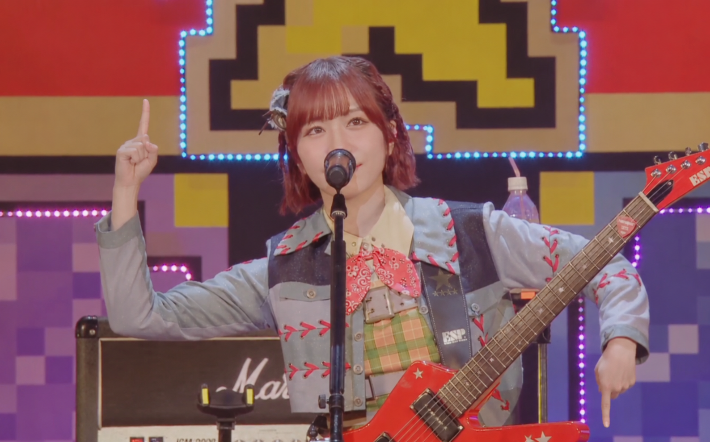

# 缺乏认同的甩手人

喜欢甩手(地下艺)的人是我见过最喜欢追求外界认同的人群之一, 热衷于炒作, 热衷于在各种各样的地方展示自己的癖好.

客观上我个人并不反对"甩手", 我个人也会在一些野生演出里玩一玩, 但是最近这个群体的作为真的很让人感到逆天.

例如之前的"财练会", 居然能解构南京大屠杀中的反人类行为当作自己的炒作素材.

例如最近的APF, APF办的很不错, 但很可惜炒作狗还是太多了.

在中日关系紧张的情况下他们居然敢在中日社交媒体上同时炒作推流, 中国的路人觉得他们在媚日, 政府会觉得他们是在挑衅权威; 对日方来说, 它们播放的音乐都是没有版权授权的, 而他们居然敢去原唱的推特下面宣传甚至邀请其明年前来参与. 日本的右翼分子也借此宣扬"中国人被日本文化殖民", 说中国人并不认可政府和民族情绪.

这就是 ACG 圏最热衷于炒作的群体 - 甩手人. 他们还喜欢跑去无关的场合引流, 例如他们知道瓶子和邦粉不和, 还是去其直播间宣传, 引导路人的情绪. 至于这种情绪是站在他们对面的, 他们也不介意, 因为反对他们本质也是对他们的一种认同. 他们喜欢这种认同, 哪怕是负面的. 我只能说这个群体配得上外界对他们的恶评, 虽然这伤害了沉默的大多数人.

