# 持续神经智能的计算范式

## 摘要

大语言模型已经证明, 大规模神经网络可以从数据中形成复杂的语言能力, 世界知识, 推理能力和行为策略. 但今天绝大多数 AI 系统仍然建立在一种传统的计算范式之上: 模型被调用, 接收输入, 完成一次推理, 返回输出, 随后这次计算结束.

与此同时, 模型与计算机世界之间的交互通常依赖自然语言, JSON 和其他序列化协议. 文件, 进程, 程序结构, 网页, 数据库和工具状态被转换成 token 输入模型, 模型再通过生成 token 描述自己希望执行的动作.

这形成了两个值得重新审视的问题.

第一, 一个本来已经高度结构化的机器世界, 为什么必须先转换成人类语言, 才能被神经系统理解和操作?

第二, 如果智能本质上是一个持续发展的过程, 为什么人工智能仍然主要以一次次彼此分离的模型调用而存在?

本文提出一种不同的计算图景.

神经系统不再仅仅是一个接受 prompt 并产生 response 的函数, 而是一个持续存在的动力过程. 它生活在一个持久化的 Semantic World 中, 直接感知和操作其中的对象, 关系, 状态和事件. 自然语言成为一种重要的输入输出模态, 而不是机器认知内部的唯一公共协议. 符号结构也不再与神经表示相互替代, 而是作为同一语义世界的另一种稳定投影.

这一架构可以概括为:

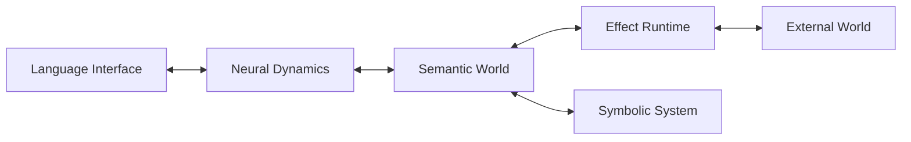

其核心问题不再只是如何构造更强的模型, 而是:

> What kind of machine should neural intelligence live in?

也就是:

> 什么样的计算环境, 才适合神经智能持续存在, 学习, 行动和演化?

## 当前 AI 范式的两个断裂

今天典型的 Agent 大致运行在下面的结构中:

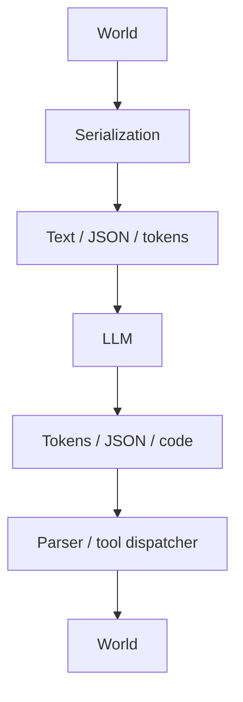

这套结构非常有效.

自然语言具有极强的通用性. JSON 具有稳定, 简单, 可调试的工程性质. 它们让完全不同的模型和软件系统能够迅速组成一个工作系统.

因此问题不是这种方法是否有用.

真正的问题是, 我们是否把一种方便的接口误认为了智能系统最终应该拥有的结构.

当前范式存在两个更基础的断裂.

### Neural 与 World 之间的表示断裂

计算机内部已经存在大量结构化世界.

编译器拥有 AST.

浏览器拥有 DOM.

操作系统拥有 process, file descriptor, socket, permission 和 resource.

数据库拥有 relation, schema 和 transaction.

程序运行时拥有 object, reference 和 type.

但当这些世界进入 LLM 时, 我们往往首先把它们展开为字符串:

```json
{
  "type": "function",
  "name": "parse_config",
  "file": "src/parser.rs"
}
```

或者直接描述为:

```text
There is a function called parse_config in src/parser.rs.
```

模型产生动作时又执行相反过程:

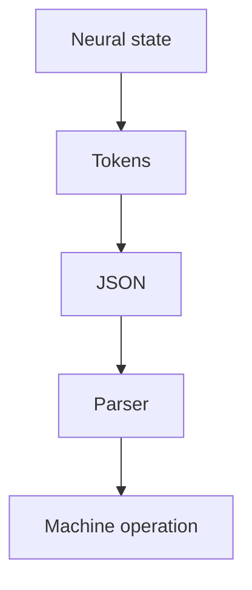

因此现代 Agent 中大量内部通信实际上经历了:

$$
Machine
\rightarrow Language
\rightarrow Neural
\rightarrow Language
\rightarrow Machine
$$

这里真正值得质疑的不是 token.

数字计算永远需要表示.

vector, token id, object id, pointer, graph node 都是表示.

更值得质疑的是:

> 为什么人类语言必须成为 Neural System 与机器世界之间的 universal IPC?

语言是优秀的人机接口.

但它未必应该成为机器认知本身的 ontology.

### Neural 与 Time 之间的连续性断裂

第二个问题发生在时间维度.

今天的大模型通常遵循:

```mermaid
flowchart TD
    C[Context] --> M[model()] --> R[Response] --> E[End]
```

下一次交互到来时:

```mermaid
flowchart TD
    I[History + memory + new input] --> M[model()] --> R[Response]
```

从应用层看, 这是一个连续存在的 Agent.

但从 neural computation 本身来看, 每一次推理依然接近一个新的 episode.

所谓 memory 通常位于模型之外:

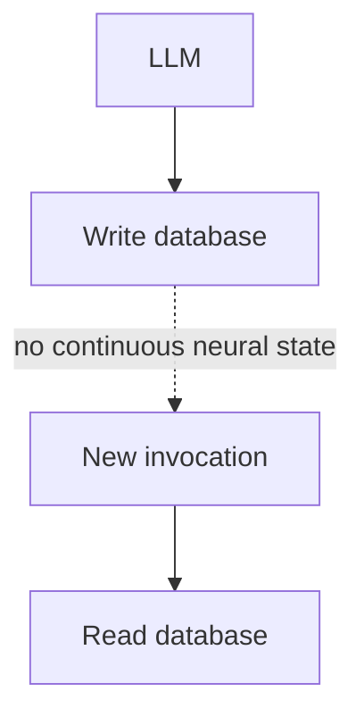

这可以构成一个有状态的软件系统.

但它还不是一个真正持续存在的 neural process.

这两个断裂指向同一个问题:

> 我们已经拥有非常强大的 neural model, 但仍然把它放置在传统 request-response computer architecture 之中.

## 核心命题: 智能不是函数, 而是过程

传统机器学习倾向于把模型写成:

$$
y=f_\theta(x)
$$

给定输入 (x), 模型产生输出 (y).

LLM 只是把这个过程扩大到序列:

$$
P(x_{t+1}\mid x_{\leq t})
$$

这种描述非常适合训练一个模型.

但它未必足以描述一个持续存在的智能体.

如果智能能够跨时间存在, 那么更自然的描述应该是:

$$
S_{t+1}=F(S_t,E_t)
$$

其中:

- (S_t) 是智能系统自身的状态
- (E_t) 是环境状态
- (F) 描述智能与环境共同演化的动力学

智能因此不再主要表现为一次映射:

$$
x\rightarrow y
$$

而表现为一条长期轨迹:

$$
\gamma={S_0,S_1,S_2,\ldots}
$$

换句话说:

> Intelligence should be understood as an evolving process, not only as an input-output function.

这也是整套架构最基础的出发点.

我们真正试图构造的不是一个永远运行的聊天机器人.

而是一个拥有自身状态, 可以持续受到环境影响, 改变环境, 学习, 稳定自身并形成长期结构的动力系统.

## Semantic Machine: 为神经智能构造一个世界

如果 Neural System 要持续存在, 那么仅仅给它一个更大的 context window 仍然不够.

它还需要一个可以长期存在于其中的世界.

这个世界不是 prompt.

也不是不断重建的 JSON snapshot.

它应该拥有自己的 identity, object, relation, event 和 state.

本文把这一层称为 Semantic World.

### Semantic World 不是数据库

假设 AI 正在操作一个软件项目.

今天模型可能看到:

```text
src/main.rs contains function main.
main calls initialize_runtime.
```

在 Semantic World 中, 更自然的表示是:

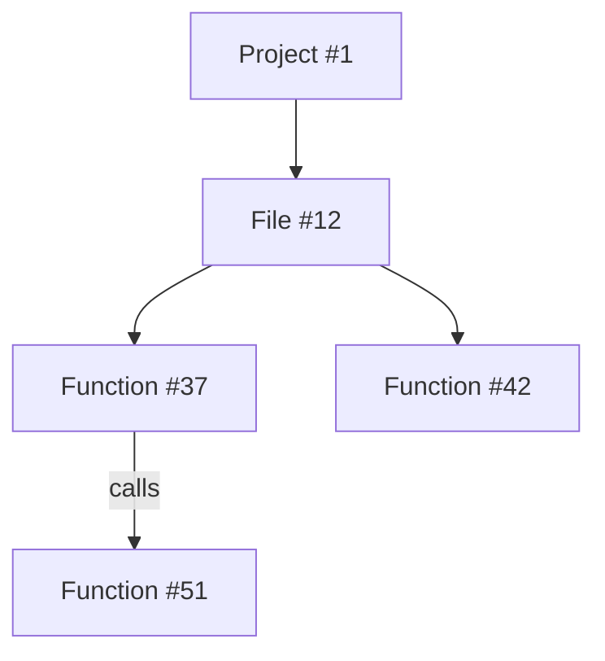

这里最重要的东西不是 graph 本身.

而是 identity.

`Function #37` 是一个持续存在的 entity.

`parse_config` 只是它可能拥有的名字.

`src/parser.rs` 只是它当前与某个 File entity 的关系.

即使函数被重命名或者移动文件, 它在系统内部仍然可以保持连续 identity.

因此模型不再必须通过字符串重新寻找同一个对象.

它可以直接持有:

```text
ObjectRef(37)
```

Semantic World 因此更像是:

> 一个神经系统和符号系统共同生活的 object reality.

### Object 不只有一种表示

Semantic World 不能简单退化成传统 knowledge graph.

如果所有对象都必须完全表示成:

```text
Function(x)
DefinedIn(x, y)
Calls(x, z)
```

那么我们只是从 JSON 换成了 predicate.

这仍然要求所有知识首先完成离散符号化.

更一般的对象应该同时拥有多个 view.

例如:

```text
Object #37
```

可以拥有一个 Symbolic View:

```lisp
(function
  :id 37
  :name parse-config
  :defined-in 12
  :calls (51 62))
```

同时拥有 Neural View:

$$
z_{37}\in\mathbb{R}^{d}
$$

其中 (z\_{37}) 可以表达:

- similarity
- uncertainty
- affordance
- context
- implicit relation
- learned usage pattern

因此 Neural 和 Symbolic 不需要不断互相翻译.

更合理的关系是:

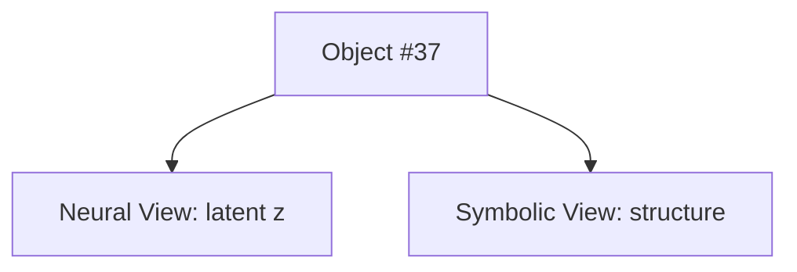

它们描述的是同一个对象.

这也是整个体系中最重要的 Neuro-Symbolic 原则之一:

> Neural representation and symbolic representation should be two views of the same semantic reality.

## Persistent Neural Dynamics: 让智能真正跨时间存在

只有 Semantic World 仍然不够.

一个真正持续的 Neural System 还必须拥有自己的时间连续性.

定义:

$$
N_t=NeuralState
$$

$$
W_t=SemanticWorld
$$

$$
E_t=ExternalEnvironment
$$

那么系统可以写成:

$$
N_{t+1}=F_{\Theta_t}(N_t,W_t,E_t)
$$

与此同时 Semantic World 也发生变化:

$$
W_{t+1}=G(W_t,N_t,E_t)
$$

整个系统于是形成闭环:

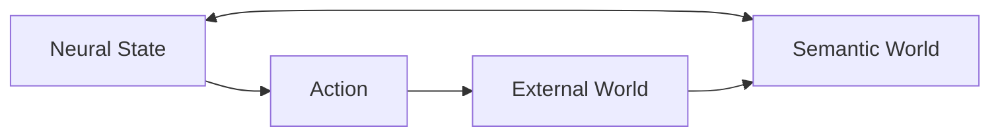

### Persistent 不等于一直计算

持续存在并不意味着 GPU 必须永远满负载.

系统可以进入:

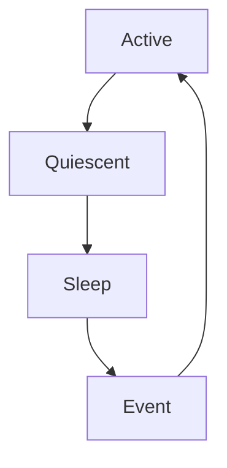

也可以:


真正重要的是因果连续性.

如果:

$$
N_{after}
$$

仍然由:

$$
N_{before}
$$

决定, 那么计算暂停并不意味着这个 neural process 已经死亡.

因此 Persistent Neural System 可以同时支持事件驱动执行和 durable execution.

### 智能需要多个时间尺度

真正的长期智能不可能只依赖一个不断变化的 hidden state.

至少需要区分:

```text
fast dynamics
```

和:

```text
slow plasticity
```

快速动力学负责:

- perception
- attention
- working state
- prediction
- immediate action

慢速动力学负责:

- long-term learning
- memory consolidation
- skill formation
- structural adaptation
- concept formation

可以写成:

$$
N_{t+1}=F_{\Theta_t}(N_t,W_t)
$$

同时:

$$
\Theta_{t+1}=P(\Theta_t,N_t,W_t)
$$

其中 (N) 快速变化, (\Theta) 缓慢变化.

这种多时间尺度结构比"给 LLM 加一个 memory database"更加接近真正持续学习的问题.

### Persistent Intelligence 必须解决稳定性问题

如果系统一直变化, 它也可能一直失去自己.

长期运行的 neural process 可能出现:

```text
state divergence
catastrophic forgetting
dead attractor
meaningless oscillation
runaway activation
identity drift
```

因此真正持续的系统还需要 homeostasis.

核心矛盾是:

$$
stability \leftrightarrow plasticity
$$

完全稳定意味着无法学习.

完全可塑意味着无法保持长期结构.

所以长期智能更可能是一种:

> stable but adaptive dynamical organization.

它不是保持某个固定状态.

而是保持一种能够在扰动中持续重组自身的组织形式.

## 从 Tool Calling 到直接作用于世界

如果 Neural System 已经生活在 Semantic World 中, 那么传统 Tool Calling 就不再是唯一交互方式.

今天的模型通常输出:

```json
{
  "tool": "edit_file",
  "arguments": {
    "path": "src/main.rs"
  }
}
```

这里发生了:

$$
NeuralState
\rightarrow Token
\rightarrow JSON
\rightarrow Parser
\rightarrow Action
$$

更直接的方式是:

$$
NeuralState
\rightarrow SemanticAction
$$

例如:

```text
ActionType = Modify
Target = ObjectRef(37)
DesiredState = z
```

甚至对象本身都可以通过 neural addressing 直接选择:

$$
P(o_i|h)=softmax(h^Te_i)
$$

这里:

- (h) 是当前 neural state
- (e_i) 是当前 world object 的 representation

模型不是生成对象名字.

它直接指向对象.

### Effect Runtime

直接操作 Semantic World 并不意味着让神经网络拥有任意系统权限.

在 Neural Intention 与 External World 之间仍然应该存在一个清晰的 Effect Runtime.

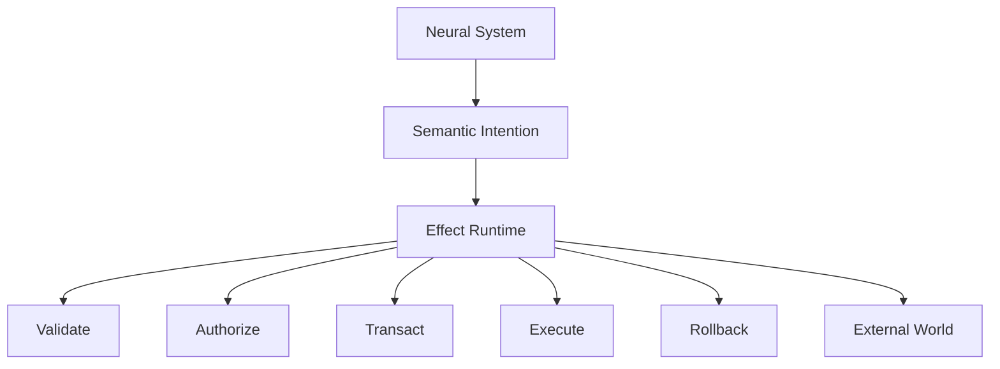

Neural System 表达:

> 我希望世界发生什么变化.

Effect Runtime 负责:

> 这个变化是否合法, 是否允许, 如何安全发生.

因此安全性和 neural direct interaction 并不冲突.

### 从动作选择到 World Model

一个真正自主的系统不应该只学习:

$$
State\rightarrow Action
$$

它还应该学习:

$$
(State,Action)\rightarrow FutureState
$$

也就是:

$$
\hat W_{t+1}=M(W_t,A_t)
$$

这样 planning 就不再必须通过语言展开:

```text
Step 1
Step 2
Step 3
```

它可以在 latent state space 中直接模拟未来:

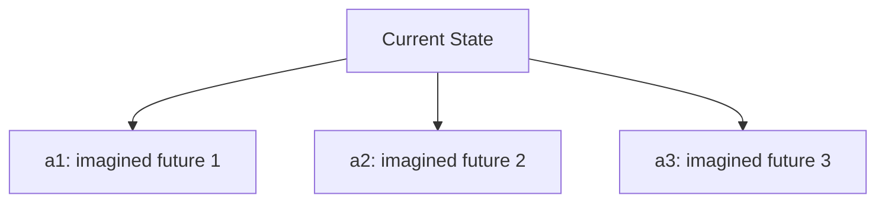

Reasoning 因而可以从:

> generate a textual chain

转变为:

> evolve and evaluate possible world states.

自然语言只在需要向人类解释时重新出现.

## Neural, Semantic 与 Symbolic 的统一

这一体系不是纯连接主义.

也不是传统符号主义.

它试图重新定义二者之间的关系.

### Neural 是连续过程

Neural System 适合处理:

```text
uncertainty
similarity
generalization
perception
association
prediction
high-dimensional structure
```

它的表示天然是连续, 分布式和上下文相关的.

### Semantic 是共享现实

Semantic World 负责提供:

```text
identity
object
relation
event
history
affordance
persistent state
```

它不是 Neural 和 Symbolic 之间的翻译器.

它是两者共同引用的世界.

### Symbolic 是稳定结构

Symbolic System 适合处理:

```text
rule
program
constraint
proof
type
composition
exact computation
reflection
```

符号结构可以一部分来自人工定义.

但更值得研究的是另一种过程:

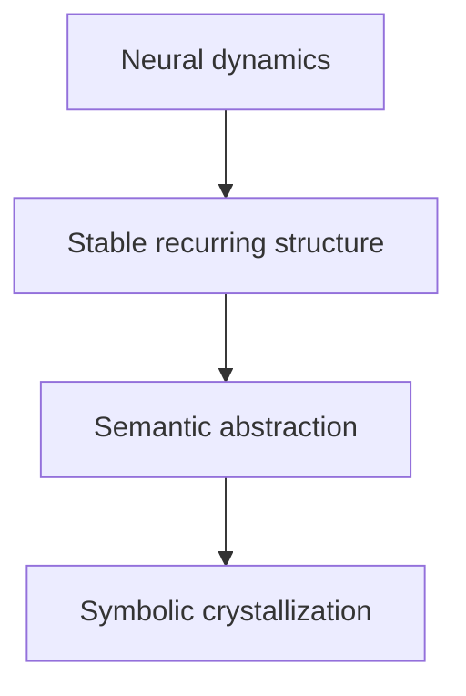

当某种 neural pattern 在长期运行中不断形成稳定结构时, 系统可以把它 reify 成一个 persistent semantic object.

这个对象随后可以获得:

```text
identity
name
relations
rules
programs
```

因此 symbolic structure 不一定永远是 neural computation 的前提.

它也可以是 neural dynamics 的产物.

可以把这种关系概括成:

> Continuous dynamics can crystallize into discrete structure.

而一旦形成的 discrete structure 又可以反过来约束和组织 neural dynamics.

于是整个系统形成循环:

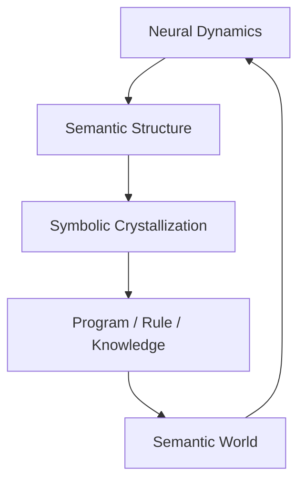

这比简单的:

```text
Neural -> Symbol -> Reasoner
```

更接近本文所设想的 Neuro-Symbolic Machine.

## Language 的重新定位

这套思想不是反对语言.

恰恰相反, Language 仍然是通用智能极其重要的能力.

人类文明的大量知识已经被压缩在语言中:

- science
- mathematics
- engineering
- law
- history
- philosophy
- culture

没有语言能力的智能系统将失去最重要的人类知识接口之一.

真正需要改变的是 Language 的地位.

今天的系统往往是:

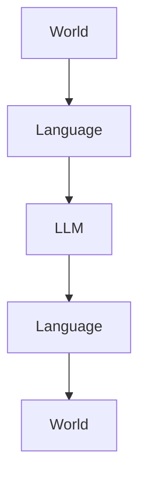

本文设想的是:

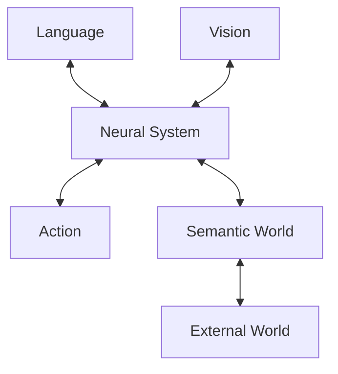

Language 从 ontology 变成 modality.

它主要承担:

```text
Human -> Machine
Machine -> Human
Civilization -> Machine
```

而不再承担所有机器内部认知活动.

因此未来的系统即使继续使用大型 Transformer, 也不一定应该继续被简单称为 LLM.

LLM 可以成为整个系统中的 language subsystem.

就像语言能力是人类智能的重要组成部分, 但并不是人的全部智能.

## 与现有 AI 范式的关系

这套思想不是凭空出现的.

它与许多已有研究方向存在明显继承关系, 但又试图把它们放入一个更统一的系统问题中.

### 与 LLM 的关系

LLM 证明了大规模 neural representation 可以形成惊人的知识和推理能力.

本文并不否定 LLM.

问题只是:

> 是否应该让这种 neural intelligence 永远被限制在 token-in, token-out 的生命周期中?

因此本文更像是在问:

> LLM 之后应该为 neural intelligence 构造什么样的运行环境?

### 与 Agent 的关系

现代 Agent 给 LLM 加上:

```text
memory
tools
planner
workflow
reflection
```

这是一条有效的工程路线.

但它通常仍然保留:

```text
LLM
  |
  v
textual tool interface
  |
  v
external software
```

本文试图把问题向下推进一层:

> 为什么 neural intelligence 与环境之间一定需要这种文本边界?

### 与 Neural Turing Machine 的关系

Neural Turing Machine 的重要思想是:

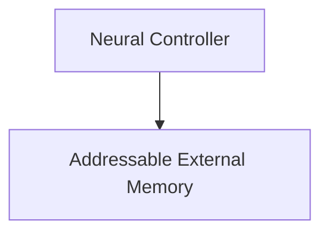

它让神经网络不再只能依赖自身有限的 recurrent state.

本文可以被看作对这一思想的进一步推广.

区别在于:

```text
NTM:
Neural <-> Memory
```

而这里是:

```text
Semantic Machine:
Neural <-> World
```

NTM 的外部结构主要服务于 computation.

Semantic World 则试图成为智能体实际生活的 persistent reality.

因此可以把这种历史关系粗略理解为:

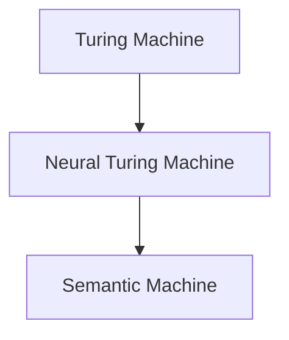

但最后一步发生了一个重要变化:

> Tape becomes World.

### 与 World Model 的关系

World Model 试图学习:

$$
P(S_{t+1}|S_t,A_t)
$$

本文完全继承这一思想.

但这里的 world 不仅是 pixel, video 或 physical state.

它还可以包含:

```text
file
process
program
document
person
goal
concept
software object
symbolic structure
```

也就是一个更一般的 semantic reality.

### 与 Neuro-Symbolic AI 的关系

传统 Neuro-Symbolic AI 经常强调:

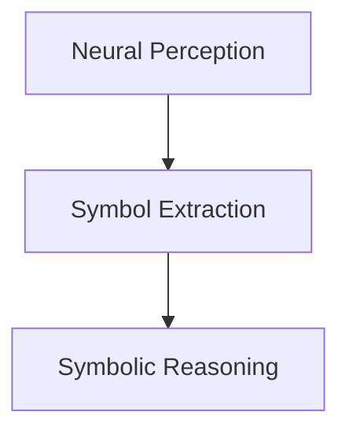

本文提出另一种关系:

```mermaid
flowchart TD
    S[Semantic World] --> N[Neural View]
    S --> Y[Symbolic View]
```

Neural 和 Symbolic 不必形成严格流水线.

它们可以共同作用于同一个世界.

## 从思想到研究计划

这套思想如果只停留在哲学描述层面, 价值非常有限.

它必须被转化为可以失败的实验.

因此真正需要研究的不是:

> 如何直接实现 AGI?

而是一系列更小, 更明确的问题.

### 第一阶段: Semantic Action

第一阶段不需要重新训练一个完整 foundation model.

目标只是证明:

> Neural model 能否直接作用于 semantic object, 而不是通过文本描述对象和动作?

构造一个有限 Semantic World:

```text
World
  |
  +-- File
  +-- AST
  +-- Function
  +-- Process
  +-- Git Object
```

然后让模型输出:

```text
(ActionType, ObjectRef, Parameters)
```

而不是:

```text
tool_name + JSON
```

实验可以直接比较:

- token cost
- action accuracy
- reference error
- latency
- long-horizon task completion

### 第二阶段: Persistent Neural State

随后加入:

$$
N_{t+1}=F(N_t,W_t)
$$

并与传统 context reconstruction 进行比较.

核心问题是:

> neural continuity 本身是否能够带来更好的长期行为连续性?

需要测试:

- long-term task continuity
- adaptation
- working memory
- robustness after interruption
- dependence on context replay

### 第三阶段: Learned World Dynamics

训练:

$$
M(W_t,A_t)\rightarrow W_{t+1}
$$

然后允许模型在 latent world 中进行 planning.

研究:

> latent simulation 是否能够部分替代 textual chain-of-thought style planning?

### 第四阶段: Multi-timescale Learning

加入 slow plasticity:

$$
\Theta_{t+1}=P(\Theta_t,N_t,W_t)
$$

研究:

- continual learning
- memory consolidation
- skill acquisition
- catastrophic forgetting
- stability-plasticity tradeoff

### 第五阶段: Homeostasis 与 Self-Organization

最终才进入最困难的问题:

> 能否设计一组足够基础的动力学和学习机制, 使一部分高级认知结构不再依赖人工模块化设计, 而从系统长期运行中自然形成?

例如研究:

- stable internal organization
- spontaneous abstraction
- persistent goal-like states
- attractor formation
- semantic crystallization
- self-maintained activity

这一步才真正进入动力学智能的问题.

### 核心可证伪假设

整套研究可以压缩成几个明确假设.

### H1

在相同模型规模下, persistent neural state 能否比纯 context reconstruction 更好地支持长期任务连续性?

### H2

直接 semantic interaction 能否比 text or JSON tool calling 提供更高的信息效率和更低的引用错误?

### H3

Neural System 与 Semantic World 的持续闭环是否能够形成比 episodic inference 更稳定的长期行为?

### H4

多时间尺度 plasticity 是否能够同时支持长期学习和能力保持?

### H5

稳定 symbolic abstraction 是否能够从长期 neural dynamics 中自动形成?

### H6

Homeostatic mechanism 是否能够让长期运行的 Neural System 在保持可塑性的同时避免状态漂移?

如果这些假设失败, 那么这条路线就需要被修正.

如果其中一部分成立, 那么它们本身也已经能够形成独立的研究成果.

## 结语: 从 Model 到 Machine

过去几十年的 AI 主要研究如何构造更好的模型.

输入进入模型.

模型完成计算.

输出离开模型.

这种思想最终产生了今天强大的 LLM.

但如果我们真正希望得到持续存在的智能, 也许下一步需要改变的不只是模型规模.

我们还需要重新考虑模型所生活的机器.

不是:

> How can a model call more tools?

而是:

> What kind of world should a neural intelligence live in?

不是:

> How can we give an LLM more memory?

而是:

> How can a neural process persist through time?

不是:

> How can neural models translate into symbolic programs?

而是:

> How can neural and symbolic structures become different views of the same reality?

这最终指向一种不同的计算实体:

$$
\boxed{
Persistent\ Neural\ Dynamics +
Semantic\ World +
Symbolic\ Structure +
Effect\ Runtime
}
$$

它不再只是一个被反复调用的模型.

也不只是一个在 LLM 外部不断增加模块的 Agent.

它更接近一个长期存在的开放动力系统.

它感知世界.

它改变世界.

世界反过来改变它.

它通过快速 neural dynamics 形成即时行为, 通过 slow plasticity 形成长期变化, 通过 homeostasis 保持自身稳定, 通过 semantic abstraction 形成可持续的世界结构, 并在必要时把这些结构结晶为可组合, 可验证的 symbol.

Language 仍然存在.

Program 仍然存在.

Symbol 仍然存在.

但它们不再等同于智能本身.

智能成为一个持续发生的过程.

机器则从执行智能模型的容器, 变成这个过程真正生活的环境.

也许从 LLM 之后真正值得追问的问题不是:

> What is the next model?

而是:

> What is the machine for intelligence?
